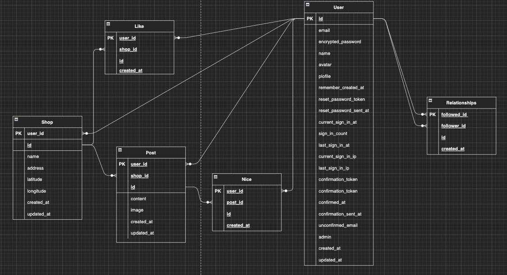
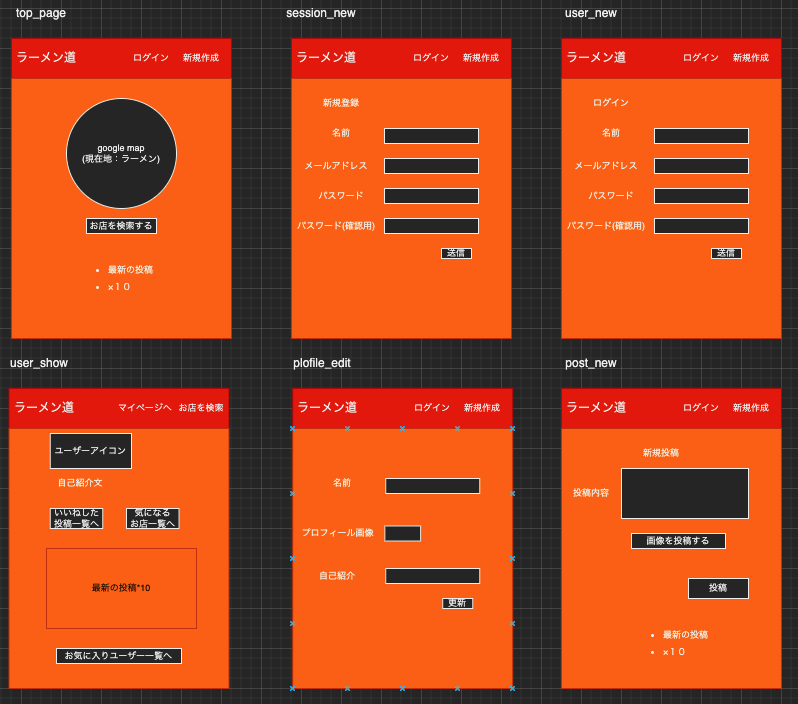
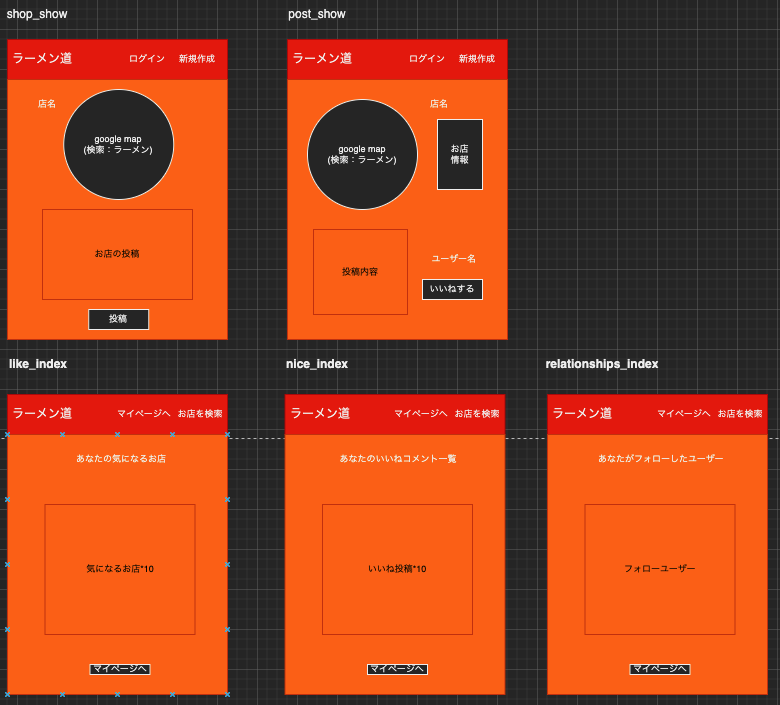
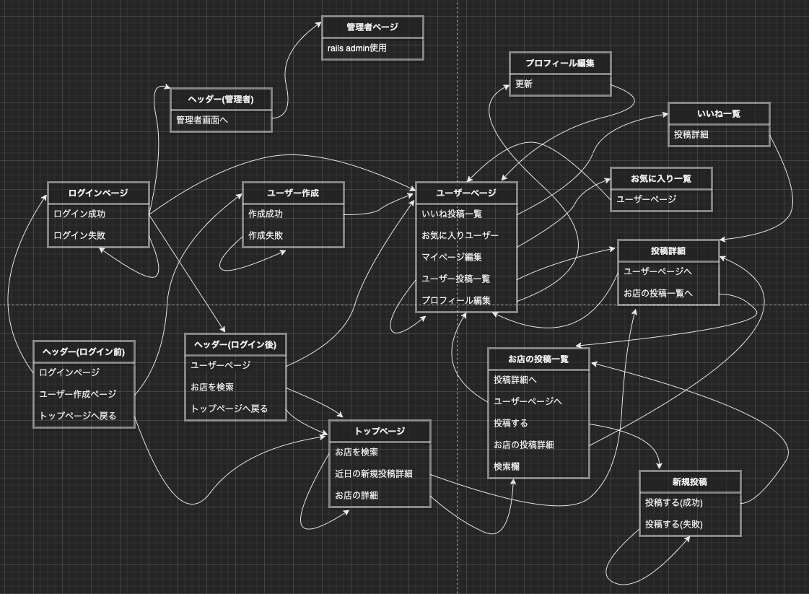

# README

## 開発言語

- ###### ruby：3.0.1 
- ###### rails：6.1.6 

### 就業Termの技術
- ###### device機能
- ###### フォロー機能
- ###### お気に入り機能
- ###### AWS EC2

### カリキュラム外の技術

- ###### Google Map Embed API
- ###### Google Map Places

### 実行手順

##### _$ git clone git@github.com:soratanaka/portfolio.git_

####  _$ cd portfolio_

#### _$ bundle install_

#### _$ rails db:create && rails db:migrate_  

#### _$ rails s_

### カタログ設計

#####  https://docs.google.com/spreadsheets/d/1eUu13rvmthjYyAUHlj_RoTr8P60ykvkwhNeMH3FEyWs/edit?usp=sharing

### テーブル定義書

##### https://docs.google.com/spreadsheets/d/1JbjjP1iAcC_CGWiyUiYotDeqHLtqq_GsS8xCifJCZAQ/edit?usp=sharing

### ER図

 

### ワイヤーフレーム

 
 

### 画面遷移図

 
